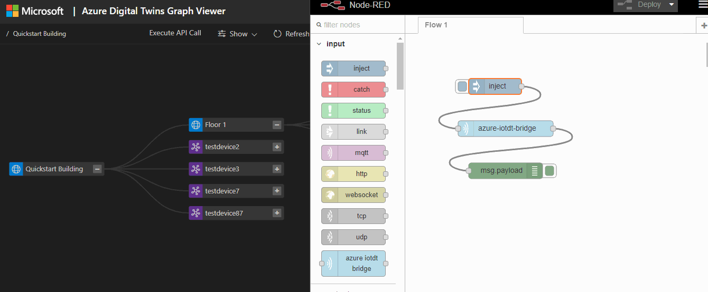
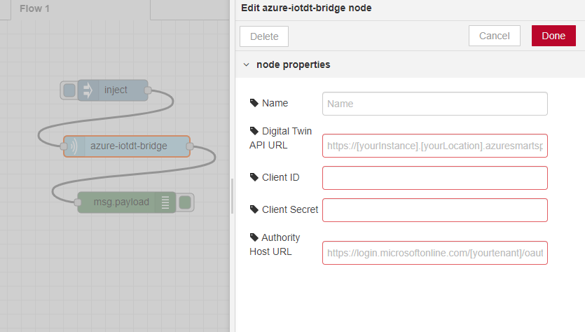
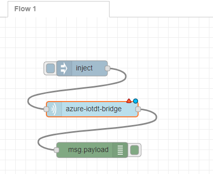

# Azure IoT Digital Twin Device Bridge module for Node-RED
This project wraps the https://github.com/iotblackbelt/iotdt-device-bridge project in a Node-RED module so that any IoT device or provider can easily be connected to Azure IoT Digital Twin (IoTDT) without any coding. 

When a properly formatted message arrives at the (configured) IoTDT Node it will try sending it as the corresponding device in IoTDT. If the device does not yet exist, it will provision a new one in IoTDT as well as its sensors in measurements. 

To use the device bridge solution, you will need the following:
- an Azure account. You can create a free Azure account from [here](https://aka.ms/aft-iot)
- an Azure Digital Twin application to connect the devices. Create an Azure Digital Twin by following [this tutorial](https://docs.microsoft.com/en-us/azure/digital-twins/tutorial-facilities-setup). You can use the open source [Azure Digital Twin Graph Viewer](https://github.com/Azure/azure-digital-twins-graph-viewer) to interact with the digital twin through a web front-end.
- an Azure Application Registration and Azure Digital Twin role assignment, which gives your Azure Digital Twin Device Bridge access rights to your Azure Digital Twin service. A step by step manual can be found on the [Application Registration page](APPLICATIONREGISTRATION.md).

## Demo


## Instructions
Take the following steps to deploy the module to Node-RED and set up the device bridge.

1.  Install the node by copying this repository into a nodes folder within the user data directory of Node-RED. Resolve the dependencies of this module by running `npm install` in the newly created folder. Note that this is only recommended for development purposes, once this module is published to npm the install process will be easier.

2. Follow the steps on the [Application Registration page](APPLICATIONREGISTRATION.md) and save the following details for use in the next step:
    - Client Id: `<Your application Id>`
    - Client Secret: `<Your client secret>`
    - Authority Host Url: `https://login.microsoftonline.com/<your tenant name>.onmicrosoft.com/oauth2/token`
    - Digital Twin API Url: `https://<your digital twin name>.<location>.azuresmartspaces.net/`


3. Open up Node-RED and notice that 'Azure IoTDT Bridge' will show up in the nodes list on the left. Drag the node onto the canvas and double click it to configure your IoTDT connection credentials from step 2.
  

4. The Node is now ready to use. External systems can feed device data through this device bridge node and into your IoT Central app by sending telemetry in the payload of messages into the input of the node. 
  

Messages sent to the device bridge node must have the following format in the payload:
```json
{
    "device": {
        "deviceId": "my-cloud-device"
    },
    "measurements": {
        "temp": 20.31,
        "pressure": 50,
        "humidity": 8.5,
        "ledColor": "blue"
    }
}
```

An optional `timestamp` field can be included in the payload, to specify the UTC date and time of the message.
This field must be in ISO format (e.g., YYYY-MM-DDTHH:mm:ss.sssZ). If `timestamp` is not provided,
the current date and time will be used.

> NOTE: `deviceId` must be the hardware Id as specified in the Azure Digital Twin. The fields in `measurements` must be the sensor hardware Id as created in Azure Digital Twin, and values of the fields in `measurements` must be numbers or strings. `device hardware Id` and `sensor hardware Id` must be unique within the boundaries of an Azure Digital Twin instance. Alignment between the sending platform and the Azure Digital Twin hardware Id naming needs to be taken into account, when provisioning the Azure Digital Twin.

5. When a message with a new `deviceId` is sent to IoTDT by the device bridge, it will be created with the sensors that were initially defined in 'measurements'. Next time the measurements will be added as values to the sensors accordingly.

